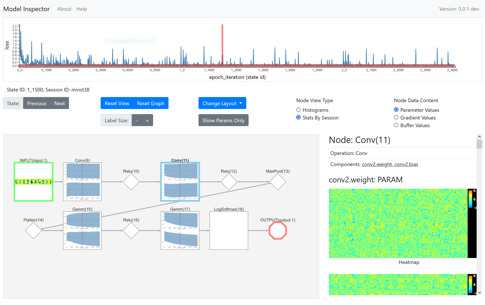

# Model Inspector

## Overview
Model Inspector is a tool for observing the internals Deep Neural Network as it's trained over time.  It consists of two components: a python logging tool and a web based UI which visualizes the logged data. It currently works with basic Pytorch models and is in the very early stages of development.

Version: **0.01-alpha**

## UI Screenshot



## Logger Usage

### 1) Import and initialize inspector
```python
data_root = 'graph_web/session_data'
session_id = "test"

from modelinspector.inspector import Inspector
inspector = Inspector(session_id,data_root)
```


### 2) Log within training loop

```python

# Log only peridocially
if i % log_freq == 0:
    inspector.log_state(epoch=epoch,
                itr=i, 
                model=model,
                input_dict={'input.1':images},
                output_dict={'output.1':output},
                loss_dict={'loss':loss},
                label_dict={'class_label':target})
    progress.display(i)

# Log every epoc
inspector.log_metrics(
    epoch=epoch,
    itr=i, 
    metrics={
        'loss':loss.item(),
        'acc1':acc1[0].item(),
        'acc5':acc5[0].item()})

```

## Build on the following projects

- cytoscape.js
- d3.js
- Pytorch

## Related Projects:
* https://github.com/waleedka/hiddenlayer/